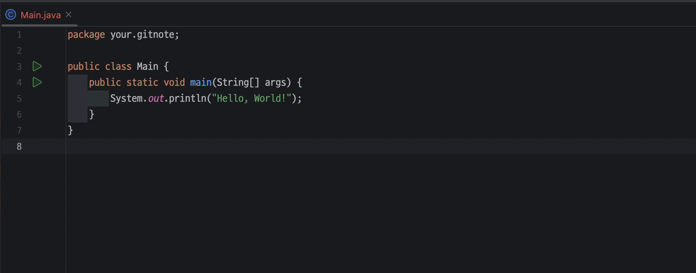

# git-note
An ephemeral comment extension based on Git.

### Motivation
Upon joining a new company, settling into your workspace, and opening up the project for the first time, you're greeted with an overwhelming expanse of code. As a professional programmer adept in various programming languages, you possess the skills to analyze the code intricately. However, even experts might find themselves momentarily perplexed by domain-specific terminology. Understanding the code's functionality is one thing, but retaining all those details to construct a comprehensive view of the system's workings is an entirely different challenge.

You could try to write down notes in a text editor or elsewhere, but it’s often hard to connect these notes with your overall understanding of the system’s architecture. Otherwise, you could also try to add comments directly to the code, but this approach is not always feasible. For instance, you might be working on a project with strict coding guidelines that prohibit the inclusion of personal notes in the codebase. Alternatively, you might be working on a project with a large team, and adding personal notes to the codebase could lead to confusion or misinterpretation.

This is where git-note comes into play—a tool designed to allow you to record your insights, comments, or notes directly related to the code while keeping them concealed from the source code itself. These comments are accessible exclusively to you and can be seamlessly integrated with your IDE, making it effortlessly easy to review your annotations within the context of the code.

### Installation
TBD
